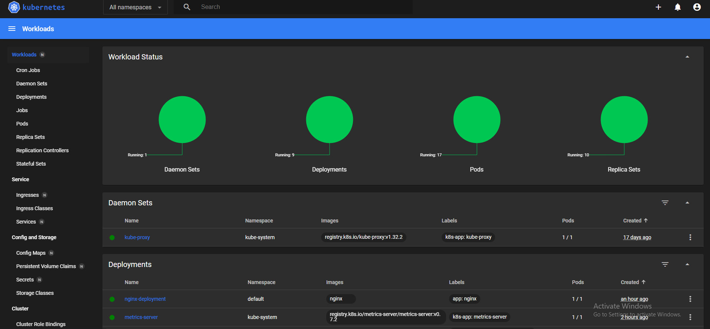
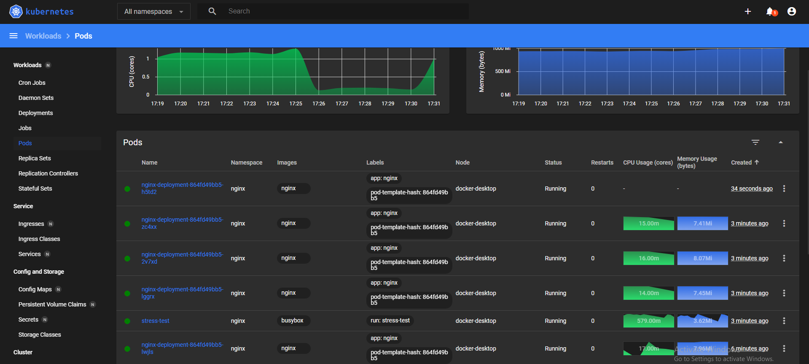

# Kubernetes NGINX Deployment with HPA and Dashboard

This project demonstrates how to deploy an **NGINX** server in Kubernetes, configure **Horizontal Pod Autoscaling (HPA)** based on CPU usage, and use the **Kubernetes Dashboard** for easy management.

## 🚀 What We Do:
- Deploy an **NGINX** container with resource requests and limits.
- Enable **Horizontal Pod Autoscaler (HPA)** to scale pods based on CPU usage.
- Set up and access the **Kubernetes Dashboard** for monitoring and managing resources.

---

## 📦🚀 Apply the Deployment
```
kubectl apply -f nginx-deployment.yaml
```
## 📊 Setting Up Kubernetes Dashboard

Install the Dashboard Using ⎈HELM:
```
helm repo add kubernetes-dashboard https://kubernetes.github.io/dashboard/
helm repo update
helm upgrade --install kubernetes-dashboard kubernetes-dashboard/kubernetes-dashboard --create-namespace --namespace kubernetes-dashboard
```
🔐 Accessing Kubernetes Dashboard Securely
To access the Kubernetes Dashboard, follow the steps below to generate a login token and securely bind the dashboard port to your local machine.

✅ Step 1: Generate a Login Token
Use the following command to generate a token for the kubernetes-dashboard-web service account:

```
kubectl create token kubernetes-dashboard-web -n kubernetes-dashboard
```

💡 This token will be used to authenticate your session in the Kubernetes Dashboard UI.

✅ Step 2: Port-Forward the Dashboard Service
To securely access the dashboard on your local machine, forward the dashboard service port:

```
kubectl -n kubernetes-dashboard port-forward svc/kubernetes-dashboard-kong-proxy 8443:443
```
This binds the dashboard to ```https://localhost:8443```

✅ Step 3: Open Dashboard in Browser
Navigate to: https://localhost:8443




## ⚙️ Set Up Horizontal Pod Autoscaler (HPA) On YAML file
To enable automatic scaling based on CPU utilization, we define the following HPA configuration in a YAML file:

```
apiVersion: autoscaling/v2
kind: HorizontalPodAutoscaler
metadata:
  name: nginx-deployment
  namespace: nginx
spec:
  scaleTargetRef:
    apiVersion: apps/v1
    kind: Deployment
    name: nginx-deployment
  minReplicas: 1
  maxReplicas: 10
  metrics:
    - type: Resource
      resource:
        name: cpu
        target:
          type: Utilization
          averageUtilization: 40
```

his configuration instructs Kubernetes to automatically scale the number of nginx-deployment pods between 1 and 10, depending on CPU usage. When the CPU utilization exceeds 40%, the HPA controller creates additional replicas to handle the load.

## Experince the autoscalling from dashboard
To simulate high traffic and trigger autoscaling, we generate continuous requests to the nginx-service using a busybox pod:

```
kubectl run stress-test -n nginx --image=busybox --restart=Never -- /bin/sh -c "while true; do wget -q -O- http://nginx-service; done"
```
After a few moments, the nginx deployment automatically scaled up to 4 replicas, as shown in the Kubernetes Dashboard:



The stress-test pod generates sustained traffic, causing the CPU usage of nginx pods to exceed the target threshold.

The HPA reacts by creating more pod replicas to distribute the load efficiently.


